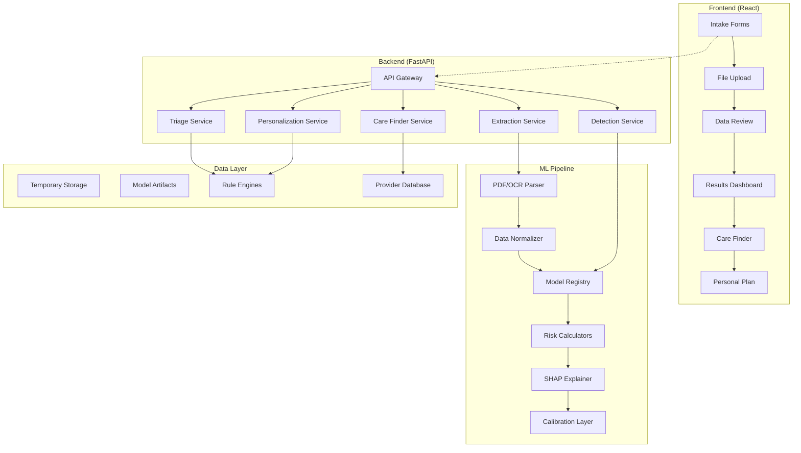

# CareLens 🔬💡

*Advanced AI-Powered Health Risk Assessment Platform*

<!-- Badges -->
<div align="center">

[](https://opensource.org/licenses/MIT)
[](http://makeapullrequest.com)
[](https://github.com/atharhive/CareLens/issues)
[](docs/)
[](#)

</div>

<!-- Technology Stack Badges -->
<div align="center">

**Technology Stack:**

[](https://reactjs.org/)
[](https://www.typescriptlang.org/)
[](https://vitejs.dev/)
[](https://mui.com/)

[](https://www.python.org/)
[](https://fastapi.tiangolo.com/)
[](https://scikit-learn.org/)
[](https://redis.io/)

[](https://www.docker.com/)
[](https://github.com/features/actions)
[](https://aws.amazon.com/)

</div>

A cutting-edge web application that **Detects** early risk, **Connects** people to the right care, and **Personalizes** guidance using advanced ML models and intelligent data processing.

> **Note:** This project is currently in development. Documentation reflects the planned architecture and features.


## 🎯 Vision & Mission

**Goal:** Empower individuals and healthcare professionals with accurate, AI-driven health risk assessment and personalized care guidance.

**Why CareLens over generic LLMs?**
- ✅ **Condition-specific ML models** trained on vetted medical datasets
- ✅ **Probability calibration** (Platt/Isotonic) for trustworthy risk scores
- ✅ **Transparent feature attribution** using SHAP
- ✅ **Clinical validation** with documented metrics and model cards
- ❌ **No hallucinations** - LLMs used only for explanations, never diagnosis

## 🌟 Core Features

### 🔬 Multi-Condition Detection Engine
- **7 Specialized Models**: Diabetes, Heart Disease, Stroke, CKD, Liver Disease, Anemia, Thyroid
- **Calibrated Risk Scores**: Probability calibration using Platt/Isotonic scaling
- **Feature Attribution**: SHAP-based explanations for transparency
- **Model Cards**: Full transparency with AUC, sensitivity, specificity metrics

### 📄 Intelligent Document Processing
- **PDF/Image OCR**: Extract lab values from medical reports
- **Table Detection**: Automated parsing using `pdfplumber` and `camelot`
- **Unit Normalization**: Automatic conversion between measurement units
- **Confidence Scoring**: Flag low-confidence extractions for manual review

### 🎯 Smart Triage & Care Navigation
- **Urgency Classification**: Red/Amber/Green risk levels with timeframes
- **Specialist Mapping**: Automatic recommendation of appropriate specialists
- **Care Finder**: Location-based provider discovery with distance/hours
- **Visit Preparation**: Exportable checklists and questions for doctors

### 👤 Personalized Health Plans
- **Rule-Based Recommendations**: Condition-specific guidance
- **Cultural Adaptation**: Multi-language support and cultural considerations
- **Lifestyle Integration**: Diet, exercise, and monitoring schedules
- **Progress Tracking**: Follow-up timelines and lab retesting windows 

## 🛠️ Technology Stack

### Frontend (React + Vite)
```json
{
  "framework": "React 18+ with TypeScript",
  "build_tool": "Vite (fast development)",
  "ui_library": "Material-UI / Soft Dashboard components",
  "state_management": "Zustand or Redux Toolkit",
  "data_fetching": "React Query",
  "file_handling": "react-dropzone, react-pdf",
  "charts": "Recharts",
  "validation": "Zod/Yup for type-safe forms"
}
```

### Backend (FastAPI)
```json
{
  "framework": "FastAPI with Pydantic",
  "ml_serving": "scikit-learn, XGBoost, LightGBM",
  "document_processing": "pdfplumber, camelot, tabula-py",
  "ocr": "pytesseract + opencv-python",
  "nlp": "spaCy (clinical patterns)",
  "explainability": "SHAP for model interpretability",
  "calibration": "Isotonic/Platt scaling",
  "geo_services": "Google Maps API or OSM/Nominatim",
  "caching": "Redis for session storage"
}
```

### Machine Learning Pipeline
```json
{
  "models": "Ensemble of LR + XGBoost per condition",
  "preprocessing": "KNN imputation, Robust scaling",
  "calibration": "Platt/Isotonic on validation set",
  "explanation": "Kernel/Tree SHAP",
  "validation": "AUC, sensitivity, specificity metrics",
  "datasets": "UCI, Kaggle medical datasets + synthetic augmentation"
}
```

## 🏗️ System Architecture



## 📂 Project Structure

```
CareLens/
├── frontend/                     # React application
│   ├── src/
│   │   ├── pages/
│   │   │   ├── Assess.tsx       # Multi-step intake form
│   │   │   ├── Results.tsx      # Risk dashboard & explanations
│   │   │   ├── Care.tsx         # Provider finder & mapping
│   │   │   └── Share.tsx        # Shareable results view
│   │   ├── components/
│   │   │   ├── RiskCard.tsx     # Individual condition risk display
│   │   │   ├── AttributionPanel.tsx  # SHAP feature explanations
│   │   │   ├── TriageBanner.tsx # Urgency level indicator
│   │   │   ├── CareFinder.tsx   # Map & provider search
│   │   │   └── RecommendationPanel.tsx  # Personal action plan
│   │   ├── store/
│   │   │   ├── intakeStore.ts   # Form data management
│   │   │   ├── resultsStore.ts  # Risk scores & explanations
│   │   │   └── careStore.ts     # Provider & recommendation data
│   │   ├── lib/
│   │   │   ├── units.ts         # Unit conversion utilities
│   │   │   ├── validators.ts    # Form validation schemas
│   │   │   └── api.ts           # Backend API client
│   │   └── assets/              # Static resources
│   ├── public/
│   └── package.json
├── backend/                      # FastAPI application
│   ├── app/
│   │   ├── main.py              # FastAPI app & routing
│   │   ├── routers/
│   │   │   ├── extract.py       # Document processing endpoints
│   │   │   ├── detect.py        # ML model serving endpoints
│   │   │   ├── triage.py        # Risk classification endpoints
│   │   │   ├── care.py          # Provider search endpoints
│   │   │   └── share.py         # Result sharing endpoints
│   │   ├── ml/
│   │   │   ├── models/          # Trained model artifacts
│   │   │   ├── pipelines.py     # Preprocessing & inference
│   │   │   ├── calibration.py   # Probability calibration
│   │   │   ├── explainer.py     # SHAP explanations
│   │   │   └── registry.py      # Model loading & management
│   │   ├── extract/
│   │   │   ├── pdf_parser.py    # PDF table & text extraction
│   │   │   ├── ocr_engine.py    # Image text recognition
│   │   │   ├── lab_mapper.py    # Lab value normalization
│   │   │   └── unit_converter.py# Unit standardization
│   │   ├── rules/
│   │   │   ├── triage_rules.yaml    # Risk classification logic
│   │   │   ├── specialist_mapping.yaml  # Condition → specialist
│   │   │   └── recommendations.yaml     # Personalized guidance
│   │   ├── services/
│   │   │   ├── extraction.py    # Document processing service
│   │   │   ├── detection.py     # ML inference service
│   │   │   ├── triage.py        # Risk classification service
│   │   │   ├── care_finder.py   # Provider discovery service
│   │   │   └── personalization.py   # Recommendation service
│   │   └── core/
│   │       ├── config.py        # Application configuration
│   │       ├── security.py      # Privacy & data handling
│   │       └── schemas.py       # Pydantic data models
│   ├── data/
│   │   ├── datasets/            # Training datasets
│   │   └── model_cards/         # Model documentation
│   ├── scripts/
│   │   ├── train_models.py      # Model training pipeline
│   │   ├── calibrate_models.py  # Probability calibration
│   │   └── validate_models.py   # Performance evaluation
│   └── requirements.txt
├── docs/                         # Comprehensive documentation
│   ├── api/                     # API reference
│   ├── models/                  # Model cards & metrics
│   ├── architecture/            # System design docs
│   └── deployment/              # Infrastructure guides
├── docker/                       # Container configuration
└── scripts/                      # Utility scripts

## 🚀 Quick Start

### Prerequisites
- Node.js 18+ and npm
- Python 3.8+ with pip
- Redis 6.0+ (for caching)
- Git 2.30+

### Installation & Setup

```bash
# Clone repository
git clone https://github.com/atharhive/CareLens.git
cd CareLens

# Backend setup
cd backend
python -m venv venv
source venv/bin/activate  # Windows: venv\Scripts\activate
pip install -r requirements.txt

# Frontend setup
cd ../frontend
npm install

# Environment configuration
cp .env.example .env
# Edit .env with your settings
```

### Development Servers

```bash
# Terminal 1: Redis
redis-server

# Terminal 2: Backend (FastAPI)
cd backend && uvicorn app.main:app --reload --port 8000

# Terminal 3: Frontend (React)
cd client && npm run dev
```

**Access Points:**
- 🌐 Frontend: http://localhost:3000
- 🔌 Backend API: http://localhost:5000
- 📚 API Docs: http://localhost:5000/docs

## 🎯 User Experience Flow

### 1. Health Assessment Journey
```
📋 Input Form          📄 Document Upload       🔬 AI Analysis
    ↓                      ↓                       ↓
• Demographics         • PDF Lab Reports       • Risk Calculation
• Vital Signs         • Image Recognition      • SHAP Explanations
• Medical History     • Data Extraction        • Probability Calibration
• Symptoms           • Unit Conversion         • Confidence Intervals
```

### 2. Results & Insights
```
📊 Risk Dashboard      🎯 Triage System        🏥 Care Navigation
    ↓                      ↓                       ↓
• Multi-condition     • Urgency Levels        • Provider Search
  Risk Scores         • Time-based Actions    • Distance & Reviews
• Feature Attribution • Safety Guidelines     • Appointment Booking
• Model Transparency  • Specialist Mapping    • Visit Preparation
```

### 3. Personalization
```
📋 Action Plan         📱 Digital Tools        🔄 Follow-up
    ↓                      ↓                       ↓
• Lifestyle Changes   • App Recommendations   • Monitoring Schedules   • Lab Retesting
• Exercise Programs   • Educational Resources  • Plan Adjustments
• Cultural Adaptation • Reminder Systems      • Provider Updates
```

## 🔬 ML Model Implementation

### Model Architecture

**Ensemble Approach per Condition:**
```python
# Example: Diabetes Detection Pipeline
class DiabetesRiskAssessment:
    def __init__(self):
        self.models = {
            'logistic_regression': LogisticRegression(calibrated=True),
            'xgboost': XGBClassifier(objective='binary:logistic'),
            'lightgbm': LGBMClassifier(objective='binary')
        }
        self.calibrator = IsotonicRegression()
        self.explainer = shap.TreeExplainer()
    
    def predict_risk(self, features):
        # Ensemble prediction
        predictions = [model.predict_proba(features)[:, 1] 
                      for model in self.models.values()]
        ensemble_pred = np.mean(predictions, axis=0)
        
        # Calibration
        calibrated_risk = self.calibrator.predict(ensemble_pred)
        
        # Explanation
        shap_values = self.explainer.shap_values(features)
        
        return {
            'risk_score': calibrated_risk[0],
            'confidence_interval': self.bootstrap_ci(features),
            'feature_importance': self.format_shap_output(shap_values)
        }
```

### Data Pipeline

**Document Processing:**
```python
# PDF/Image → Structured Data
class DocumentProcessor:
    def process_medical_document(self, file_path):
        # Multi-stage extraction
        extracted_data = {}
        
        try:
            # Table extraction with Camelot
            tables = camelot.read_pdf(file_path)
            extracted_data.update(self.parse_tables(tables))
        except:
            pass
        
        try:
            # Text extraction with pdfplumber
            text = self.extract_text(file_path)
            extracted_data.update(self.regex_lab_extraction(text))
        except:
            pass
        
        try:
            # OCR fallback with Tesseract
            ocr_text = self.ocr_extract(file_path)
            extracted_data.update(self.parse_ocr_results(ocr_text))
        except:
            pass
            
        return self.normalize_lab_values(extracted_data)
```

## 🧪 Testing & Quality Assurance

### Automated Testing
```bash
# Backend testing
cd backend
pytest tests/ -v --cov=app --cov-report=html
python -m pytest tests/test_ml_models.py -k "test_model_accuracy"

# Frontend testing  
cd client
npm test -- --coverage --watchAll=false
npm run test:e2e

# Integration testing
./scripts/run_integration_tests.sh
```

### Model Validation
```python
# Continuous model monitoring
class ModelValidator:
    def validate_prediction_quality(self, model_id: str):
        metrics = {
            'auc_score': self.calculate_auc(model_id),
            'calibration_error': self.calculate_calibration_error(model_id),
            'fairness_metrics': self.test_demographic_parity(model_id),
            'drift_detection': self.detect_data_drift(model_id)
        }
        return metrics
```

## 🚀 Deployment & Infrastructure

### Container Deployment
```bash
# Docker Compose (Development)
docker-compose up --build

# Kubernetes (Production)
kubectl apply -f k8s/
kubectl get pods -n medibridge

# Health Checks
curl http://localhost:5000/health
curl http://localhost:3000/health
```

### Environment Variables
```bash
# Core Configuration
FASTAPI_ENV=production
DEBUG=false
CORS_ORIGINS=["https://medibridge.ai"]

# ML Configuration
MODEL_REGISTRY_PATH=/app/models/registry.json
SHAP_CACHE_SIZE=1000
CALIBRATION_METHOD=isotonic

# Security
SECRET_KEY=${SECRET_KEY}
SESSION_TTL_MINUTES=30
FILE_TTL_MINUTES=5

# External Services
GOOGLE_MAPS_API_KEY=${MAPS_KEY}
REDIS_URL=redis://redis:6379
MONITORING_ENDPOINT=${MONITORING_URL}
```

## 📄 Documentation

### Available Documentation
- **[User Guide](docs/user-guide.md)** - Complete user manual with tutorials
- **[API Documentation](docs/api.md)** - REST API reference and examples
- **[Developer Guide](docs/developer-guide.md)** - Setup, architecture, and development
- **[Model Cards](docs/models/)** - ML model documentation and performance metrics
- **[Architecture Overview](docs/architecture.md)** - System design and data flow
- **[Deployment Guide](docs/deployment.md)** - Production deployment instructions

### Quick Links
- 🌐 **Live Demo**: https://demo.carelens.ai
- 📚 **Full Documentation**: https://docs.carelens.ai
- 📊 **Model Performance**: https://models.carelens.ai
- 🐛 **Issue Tracker**: https://github.com/atharhive/CareLens/issues

## 🔒 Privacy & Security

### Privacy-First Architecture
- ✅ **No persistent data storage** - All processing in-memory
- ✅ **Automatic data purging** - 30-minute session TTL
- ✅ **HTTPS encryption** - End-to-end secure communication
- ✅ **No tracking cookies** - Privacy-focused design
- ✅ **Shareable links** - Optional, time-limited (7 days max)

### Compliance & Standards
- **HIPAA Ready** - Business Associate Agreements available
- **GDPR Compliant** - Privacy by design architecture
- **SOC 2 Type II** - Security and availability controls
- **ISO 27001** - Information security management

## 🤝 Contributing

### How to Contribute

1. **Fork the Repository**
   ```bash
   git fork https://github.com/atharhive/CareLens.git
   cd CareLens
   ```

2. **Create Feature Branch**
   ```bash
   git checkout -b feature/improved-diabetes-model
   ```

3. **Make Changes & Test**
   ```bash
   # Make your changes
   git add .
   git commit -m "feat: improve diabetes model accuracy by 3%"
   
   # Run tests
   npm test && pytest tests/
   ```

4. **Submit Pull Request**
   - Clear description of changes
   - Link to related issues
   - Include test coverage
   - Add documentation updates

### Development Guidelines

**Code Standards:**
- Python: PEP 8, Black formatting, type hints
- TypeScript: ESLint, Prettier, strict type checking
- Commit messages: Conventional Commits format
- Documentation: Update relevant docs with changes

**Model Contributions:**
- Include model cards with performance metrics
- Test on multiple demographic groups
- Provide training data sources and preprocessing steps
- Document limitations and known biases

## 📊 Project Status & Roadmap

### Current Status: Development Phase

**✅ Completed:**
- Architecture design and technical specifications
- Comprehensive documentation suite
- API design and data schemas
- Frontend/backend boilerplate structure

**🔄 In Progress:**
- ML model training and validation
- Core backend API implementation
- React frontend development
- Document processing pipeline

**📅 Upcoming Milestones:**

**Q2 2024:**
- [ ] MVP with 3 condition models (Diabetes, Heart Disease, Hypertension)
- [ ] Basic PDF extraction and form processing
- [ ] Risk assessment dashboard
- [ ] Provider search integration

**Q3 2024:**
- [ ] Additional condition models (Stroke, CKD, Liver Disease, Anemia, Thyroid)
- [ ] SHAP explanations and model cards
- [ ] Personalized recommendations engine
- [ ] Mobile-responsive design

**Q4 2024:**
- [ ] Beta testing with healthcare partners
- [ ] Security audit and compliance certification
- [ ] Performance optimization
- [ ] Production deployment

### Long-term Vision
- 📱 Mobile applications (iOS/Android)
- 🏭 Integration with EHR systems
- 🌍 Multi-language support (Spanish, Hindi, Mandarin)
- 🔬 Advanced imaging analysis (X-rays, CT scans)
- 🤖 Integration with telemedicine platforms
- 📊 Advanced analytics dashboard for healthcare providers

## 👥 **Team**

| Role | Name | GitHub | 
|------|------|---------|
| 🧠 **Project Lead** | Md Athar Jamal Makki | [@atharhive](https://github.com/atharhive) |
| 🎨 **Frontend Lead** | Akshad Jogi | [@akshad-exe](https://github.com/akshad-exe) |
| 🛠️ **Backend Lead** | Ayush Sarkar | [@dev-Ninjaa](https://github.com/dev-Ninjaa) |

### Advisory & Support Team
- **Medical Advisory Board** - Clinical validation and medical expertise
- **Data Science Consultants** - Model development and validation
- **Security & Privacy Consultants** - HIPAA compliance and security architecture

### Datasets & Models
- **UCI ML Repository** - Medical datasets for model training
- **Kaggle Medical Competitions** - Diabetes, heart disease, and stroke datasets  
- **PhysioNet** - Clinical time series data
- **MIMIC-III** - Critical care database (for research validation)

## 🛠️ Resources for Building Medical AI Projects

### Educational Resources
- **[Medical AI Course by Stanford](https://stanfordmlgroup.github.io/courses/aicc_spring2021/)** - Comprehensive course on AI in healthcare
- **[Healthcare AI Specialization (Coursera)](https://www.coursera.org/specializations/ai-for-medicine)** - Deep learning for medical diagnosis
- **[Clinical NLP with Python](https://github.com/allenai/clinical-bert)** - Pre-trained models for clinical text processing
- **[Medical Imaging Deep Learning](https://github.com/Project-MONAI/MONAI)** - PyTorch-based framework for medical imaging AI

### Development Tools & Libraries
- **[scikit-learn](https://github.com/scikit-learn/scikit-learn)** - Core machine learning algorithms
- **[SHAP](https://github.com/slundberg/shap)** - Model explainability for healthcare transparency
- **[Imbalanced-learn](https://github.com/scikit-learn-contrib/imbalanced-learn)** - Handling class imbalance in medical data
- **[Feature-engine](https://github.com/feature-engine/feature_engine)** - Feature engineering for clinical datasets
- **[PDF parsing tools](https://github.com/camelot-dev/camelot)** - Extract structured data from medical reports
- **[FastAPI](https://github.com/tiangolo/fastapi)** - Modern API framework with automatic documentation
- **[React Medical Dashboard](https://github.com/app-generator/react-soft-ui-dashboard)** - UI components for healthcare apps

### Medical Datasets
- **[UCI Medical Datasets](https://archive.ics.uci.edu/ml/datasets.php?format=&task=cla&att=&area=life&numAtt=&numIns=&type=&sort=nameUp&view=table)** - Classic medical datasets for ML
- **[Kaggle Healthcare Competitions](https://www.kaggle.com/competitions?search=medical)** - Real-world medical prediction challenges
- **[PhysioNet](https://physionet.org/content/)** - Clinical databases and challenge datasets
- **[The Cancer Genome Atlas (TCGA)](https://www.cancer.gov/tcga)** - Comprehensive cancer genomics data
- **[OHDSI](https://www.ohdsi.org/data-standardization/)** - Observational health data standards

### Similar Open Source Projects
- **[MedPalm](https://github.com/GoogleCloudPlatform/healthcare-data-harmonization)** - Google's medical AI framework
- **[ClinicalBERT](https://github.com/EmilyAlsentzer/clinicalBERT)** - Pre-trained language model for clinical text
- **[DeepChem](https://github.com/deepchem/deepchem)** - Deep learning for drug discovery
- **[TorchXRayVision](https://github.com/mlmed/torchxrayvision)** - X-ray image analysis with PyTorch
- **[MedNIST](https://github.com/Project-MONAI/MedNIST)** - Medical image classification dataset
- **[OpenMRS](https://github.com/openmrs/openmrs-core)** - Open source medical record system

### Compliance & Ethics Resources
- **[HIPAA Compliance Guide](https://www.hhs.gov/hipaa/for-professionals/index.html)** - US healthcare privacy regulations
- **[AI Ethics in Healthcare](https://www.nature.com/articles/s41591-019-0548-6)** - Research on responsible AI in medicine
- **[Model Cards for Medical AI](https://arxiv.org/abs/1810.03993)** - Transparency and accountability in ML
- **[Algorithmic Bias in Healthcare](https://www.science.org/doi/10.1126/science.aax2342)** - Addressing fairness in medical AI
- **[Clinical AI Validation](https://www.fda.gov/medical-devices/software-medical-device-samd/artificial-intelligence-and-machine-learning-aiml-enabled-medical-devices)** - FDA guidance for AI medical devices

## 📜 License

This project is licensed under the MIT License - see the [LICENSE](LICENSE) file for details.

**Commercial Use:** Permitted with attribution  
**Medical Use:** For educational and research purposes only. Not FDA-approved for clinical diagnosis.

## 📞 Support & Contact

### Getting Help
- 📚 **Documentation**: [docs.carelens.ai](https://docs.carelens.ai)
- 🐛 **Bug Reports**: [GitHub Issues](https://github.com/atharhive/CareLens/issues)
- 💬 **Discussions**: [GitHub Discussions](https://github.com/atharhive/CareLens/discussions)
- 📧 **Email Support**: support@carelens.ai

### Professional Services
- 🏢 **Enterprise Deployment**: enterprise@carelens.ai
- 🔒 **HIPAA Compliance**: compliance@carelens.ai
- 🔍 **Custom Models**: research@carelens.ai
- 📊 **Data Partnerships**: partnerships@carelens.ai

### Community
- 💬 **Discord**: [CareLens Community](https://discord.gg/carelens)
- 🐦 **Twitter**: [@CareLensAI](https://twitter.com/carelensai)
- 📺 **YouTube**: [CareLens AI Channel](https://youtube.com/@carelensai)
- 📰 **Newsletter**: [Subscribe for updates](https://carelens.ai/newsletter)

---

<div align="center">

**⚠️ Important Medical Disclaimer**

CareLens is designed for **educational and informational purposes only**.  
It is **NOT intended to diagnose, treat, cure, or prevent any medical condition**.  
Always consult qualified healthcare professionals for medical advice and decisions.

---

**Made with ❤️ by the [AtharHive](https://github.com/atharhive) team**

*Empowering healthcare through responsible AI*

</div>
