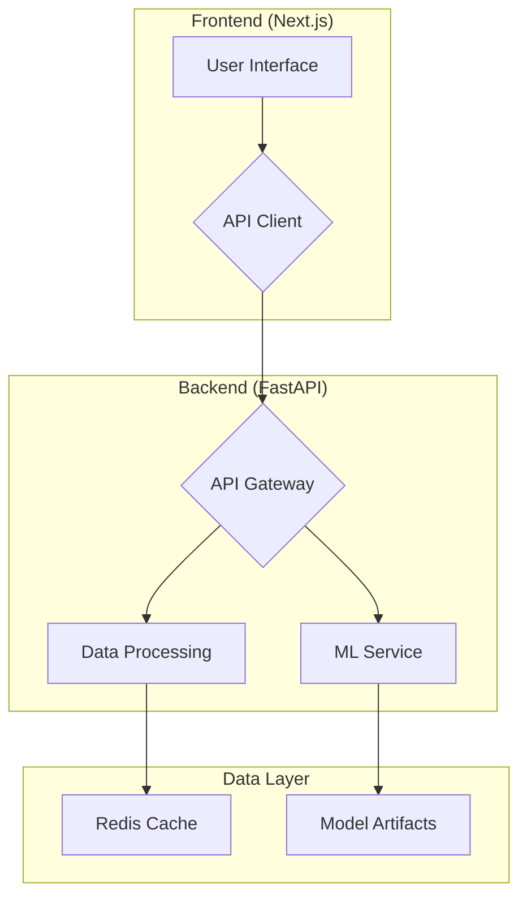

# 🏗️ System Architecture

This document provides a high-level overview of the CareLens system architecture. The current implementation is a classic client-server model with a React-based frontend and a Python-based backend.

## Components

### Frontend

- **Framework:** [Next.js](https://nextjs.org/) (a React framework)
- **UI Components:** [shadcn/ui](https://ui.shadcn.com/)
- **State Management:** [Zustand](https://github.com/pmndrs/zustand)
- **Description:** The frontend is a single-page application (SPA) that provides the user interface for the health assessment, results visualization, and care navigation features. It communicates with the backend via a REST API.

### Backend

- **Framework:** [FastAPI](https://fastapi.tiangolo.com/)
- **Machine Learning:** [scikit-learn](https://scikit-learn.org/), [XGBoost](https://xgboost.ai/), [LightGBM](https://lightgbm.readthedocs.io/)
- **Document Processing:** [pdfplumber](https://github.com/jsvine/pdfplumber), [camelot-py](https://github.com/camelot-dev/camelot), [pytesseract](https://pypi.org/project/pytesseract/)
- **Caching:** [Redis](https://redis.io/)
- **Description:** The backend provides the core functionality of the application, including the machine learning models for risk assessment, document processing for lab report analysis, and the API for the frontend.
