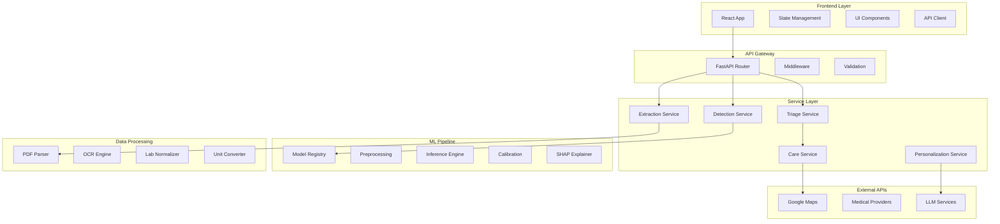

# MediBridge AI - Developer Guide

## Table of Contents
- [Quick Start](#quick-start)
- [Development Environment](#development-environment)
- [Architecture Deep Dive](#architecture-deep-dive)
- [Machine Learning Pipeline](#machine-learning-pipeline)
- [Frontend Development](#frontend-development)
- [Backend Development](#backend-development)
- [Testing Strategy](#testing-strategy)
- [Deployment](#deployment)
- [Contributing Guidelines](#contributing-guidelines)

---

## Quick Start

### Prerequisites
```bash
# System requirements
Node.js >= 18.0.0
Python >= 3.8.0
Redis >= 6.0.0
Git >= 2.30.0

# Optional (for local development)
Docker >= 20.10.0
PostgreSQL >= 13.0 (if using persistent storage)
```

### Clone and Setup
```bash
# Clone the repository
git clone https://github.com/atharhive/CareLens.git
cd CareLens

# Setup backend environment
cd backend
python -m venv venv
source venv/bin/activate  # On Windows: venv\Scripts\activate
pip install -r requirements.txt

# Setup frontend environment
cd ../frontend
npm install

# Create environment configuration
cp .env.example .env
# Edit .env with your configuration
```

### Environment Variables
```bash
# Backend (.env)
FASTAPI_ENV=development
DEBUG=true
CORS_ORIGINS=["http://localhost:3000"]
REDIS_URL=redis://localhost:6379

# API Keys (optional for development)
GOOGLE_MAPS_API_KEY=your_key_here
OPENAI_API_KEY=your_key_here  # For explanation generation

# Model paths
MODEL_DIR=./data/models
MODEL_REGISTRY_PATH=./data/model_registry.json

# Privacy settings
SESSION_TTL_MINUTES=30
FILE_TTL_MINUTES=5
SHARE_LINK_MAX_DAYS=7

# Frontend (.env.local)
VITE_API_BASE_URL=http://localhost:5000
VITE_GOOGLE_MAPS_KEY=your_key_here
VITE_ENABLE_ANALYTICS=false
```

### Start Development Servers
```bash
# Terminal 1: Backend (FastAPI)
cd backend
uvicorn app.main:app --reload --port 8000

# Terminal 2: Frontend (React + Vite)
cd frontend
npm run dev

# Terminal 3: Redis (if not using Docker)
redis-server
```

**Access Points:**
- Frontend: http://localhost:3000
- Backend API: http://localhost:5000
- API Documentation: http://localhost:5000/docs

---

## Development Environment

### Recommended IDE Setup

**VSCode Extensions:**
```json
{
  "recommendations": [
    "ms-python.python",
    "ms-python.black-formatter",
    "ms-python.isort",
    "bradlc.vscode-tailwindcss",
    "esbenp.prettier-vscode",
    "ms-vscode.vscode-typescript-next",
    "ms-toolsai.jupyter"
  ]
}
```

**Python Setup:**
```bash
# Install development dependencies
pip install -e ".[dev]"

# Setup pre-commit hooks
pre-commit install

# Run formatting
black app/ scripts/
isort app/ scripts/
flake8 app/
```

**Node.js Setup:**
```bash
# Install development dependencies
npm install --include=dev

# Setup ESLint and Prettier
npm run lint
npm run format

# Type checking
npm run type-check
```

### Development Workflow

1. **Feature Branch Model:**
   ```bash
   git checkout -b feature/condition-detection-improvement
   # Make changes
   git commit -m "feat: improve diabetes model accuracy"
   git push origin feature/condition-detection-improvement
   # Create pull request
   ```

2. **Code Quality Checks:**
   ```bash
   # Backend
   pytest tests/
   black --check app/
   isort --check app/
   flake8 app/
   mypy app/

   # Frontend  
   npm run test
   npm run lint
   npm run type-check
   npm run build
   ```

3. **Database Migrations (if applicable):**
   ```bash
   # Create migration
   alembic revision --autogenerate -m "Add user preferences table"
   
   # Apply migration
   alembic upgrade head
   ```

---

## Architecture Deep Dive

### System Components



### Data Flow Architecture

```python
# Example: Complete health assessment pipeline
class HealthAssessmentPipeline:
    def __init__(self):
        self.extraction_service = ExtractionService()
        self.detection_service = DetectionService()
        self.triage_service = TriageService()
        self.recommendation_service = RecommendationService()
    
    async def process_assessment(self, form_data, uploaded_files):
        # Step 1: Normalize intake data
        normalized_data = await self.normalize_intake_data(form_data)
        
        # Step 2: Extract lab values from documents
        extracted_labs = await self.extraction_service.process_files(uploaded_files)
        
        # Step 3: Combine and validate all data
        complete_data = self.merge_patient_data(normalized_data, extracted_labs)
        
        # Step 4: Run ML detection models
        risk_assessments = await self.detection_service.assess_risks(complete_data)
        
        # Step 5: Determine triage level
        triage_result = self.triage_service.classify_urgency(risk_assessments)
        
        # Step 6: Generate personalized recommendations
        recommendations = await self.recommendation_service.generate_plan(
            complete_data, risk_assessments, triage_result
        )
        
        return {
            "risk_assessments": risk_assessments,
            "triage": triage_result,
            "recommendations": recommendations
        }
```

### Security Architecture

**Privacy-First Design:**
```python
class PrivacyManager:
    def __init__(self):
        self.session_ttl = timedelta(minutes=30)
        self.file_ttl = timedelta(minutes=5)
        
    def create_session(self) -> str:
        """Create temporary session with auto-expiry"""
        session_id = str(uuid4())
        self.redis.setex(f"session:{session_id}", self.session_ttl, "{}")
        return session_id
    
    def store_temporary_file(self, file_data: bytes) -> str:
        """Store file temporarily with TTL"""
        file_id = str(uuid4())
        file_path = f"/tmp/uploads/{file_id}"
        
        # Write file with restricted permissions
        with open(file_path, 'wb', permissions=0o600) as f:
            f.write(file_data)
        
        # Schedule deletion
        self.scheduler.enter(self.file_ttl.total_seconds(), 1, self.delete_file, (file_path,))
        return file_id
    
    def create_share_link(self, result_data: dict, ttl_days: int = 7) -> str:
        """Create shareable results with expiration"""
        share_id = secrets.token_urlsafe(32)
        expiry = datetime.utcnow() + timedelta(days=ttl_days)
        
        self.redis.setex(
            f"share:{share_id}",
            timedelta(days=ttl_days),
            json.dumps(result_data)
        )
        return f"https://share.medibridge.ai/r/{share_id}"
```

---

## Machine Learning Pipeline

### Model Architecture

**Condition-Specific Ensemble Models:**

```python
class ConditionDetector:
    """Base class for condition-specific detection models"""
    
    def __init__(self, condition: str):
        self.condition = condition
        self.models = {}
        self.calibrator = None
        self.feature_names = []
        self.preprocessing_pipeline = None
        
    def load_models(self, model_dir: Path):
        """Load ensemble of models for this condition"""
        self.models = {
            'logistic': joblib.load(model_dir / f"{self.condition}_lr.pkl"),
            'xgboost': joblib.load(model_dir / f"{self.condition}_xgb.pkl"),
            'lightgbm': joblib.load(model_dir / f"{self.condition}_lgb.pkl")
        }
        self.calibrator = joblib.load(model_dir / f"{self.condition}_calibrator.pkl")
        
    def preprocess(self, raw_data: dict) -> np.ndarray:
        """Apply preprocessing pipeline"""
        return self.preprocessing_pipeline.transform(raw_data)
    
    def predict_risk(self, features: np.ndarray) -> Dict[str, float]:
        """Generate calibrated risk prediction with ensemble"""
        # Get predictions from all models
        predictions = {}
        for name, model in self.models.items():
            predictions[name] = model.predict_proba(features)[:, 1]
        
        # Ensemble averaging
        ensemble_pred = np.mean(list(predictions.values()), axis=0)
        
        # Apply calibration
        calibrated_prob = self.calibrator.predict_proba(
            ensemble_pred.reshape(-1, 1)
        )[:, 1]
        
        # Calculate confidence intervals (bootstrap)
        ci_lower, ci_upper = self.bootstrap_confidence_interval(
            features, n_bootstrap=100
        )
        
        return {
            'risk_score': float(calibrated_prob[0]),
            'confidence_interval': [float(ci_lower), float(ci_upper)],
            'individual_models': {k: float(v[0]) for k, v in predictions.items()}
        }
    
    def explain_prediction(self, features: np.ndarray) -> List[Dict]:
        """Generate SHAP explanations for the prediction"""
        explainer = shap.Explainer(self.models['xgboost'])
        shap_values = explainer(features)
        
        feature_contributions = []
        for i, feature_name in enumerate(self.feature_names):
            feature_contributions.append({
                'feature': feature_name,
                'value': float(features[0, i]),
                'contribution': float(shap_values.values[0, i]),
                'direction': 'increases_risk' if shap_values.values[0, i] > 0 else 'decreases_risk'
            })
        
        # Sort by absolute contribution
        feature_contributions.sort(key=lambda x: abs(x['contribution']), reverse=True)
        return feature_contributions[:5]  # Top 5 features

# Specific condition implementations
class DiabetesDetector(ConditionDetector):
    def __init__(self):
        super().__init__('diabetes')
        self.feature_names = [
            'age', 'bmi', 'hba1c', 'fasting_glucose', 'family_history_diabetes',
            'systolic_bp', 'diastolic_bp', 'hdl_cholesterol', 'triglycerides'
        ]
    
    def preprocess(self, raw_data: dict) -> np.ndarray:
        """Diabetes-specific preprocessing"""
        features = []
        
        # Basic demographics
        features.append(raw_data.get('age', 0))
        
        # Calculate BMI if not provided
        if 'bmi' in raw_data:
            features.append(raw_data['bmi'])
        else:
            height_m = raw_data.get('height', 170) / 100
            weight_kg = raw_data.get('weight', 70)
            features.append(weight_kg / (height_m ** 2))
        
        # Lab values with imputation
        features.append(raw_data.get('hba1c', {}).get('value', 5.7))  # Normal default
        features.append(raw_data.get('fasting_glucose', {}).get('value', 95))
        
        # Binary features
        features.append(1 if 'diabetes' in raw_data.get('family_history', []) else 0)
        
        # Vitals
        features.append(raw_data.get('systolic_bp', 120))
        features.append(raw_data.get('diastolic_bp', 80))
        
        # Additional labs
        features.append(raw_data.get('hdl_cholesterol', {}).get('value', 50))
        features.append(raw_data.get('triglycerides', {}).get('value', 150))
        
        return np.array(features).reshape(1, -1)

class HeartDiseaseDetector(ConditionDetector):
    def __init__(self):
        super().__init__('heart_disease')
        self.feature_names = [
            'age', 'sex', 'chest_pain_type', 'systolic_bp', 'cholesterol',
            'fasting_bs', 'max_heart_rate', 'exercise_induced_angina',
            'st_depression', 'slope', 'num_major_vessels', 'thalassemia'
        ]
```

### Model Training Pipeline

```python
class ModelTrainingPipeline:
    def __init__(self, condition: str):
        self.condition = condition
        self.config = self.load_training_config()
        
    def train_condition_models(self, data_path: Path):
        """Complete training pipeline for a condition"""
        # Load and prepare data
        X, y = self.load_training_data(data_path)
        X_train, X_test, y_train, y_test = train_test_split(
            X, y, test_size=0.2, stratify=y, random_state=42
        )
        
        # Preprocessing pipeline
        preprocessor = self.create_preprocessing_pipeline()
        X_train_processed = preprocessor.fit_transform(X_train)
        X_test_processed = preprocessor.transform(X_test)
        
        # Train individual models
        models = {}
        models['logistic'] = self.train_logistic_regression(X_train_processed, y_train)
        models['xgboost'] = self.train_xgboost(X_train_processed, y_train)
        models['lightgbm'] = self.train_lightgbm(X_train_processed, y_train)
        
        # Ensemble predictions for calibration
        train_probs = self.get_ensemble_predictions(models, X_train_processed)
        test_probs = self.get_ensemble_predictions(models, X_test_processed)
        
        # Calibrate probabilities
        calibrator = CalibratedClassifierCV(
            DummyClassifier(), method='isotonic', cv='prefit'
        )
        calibrator.fit(train_probs.reshape(-1, 1), y_train)
        
        # Evaluate models
        metrics = self.evaluate_models(calibrator, test_probs, y_test)
        
        # Save artifacts
        self.save_model_artifacts(models, calibrator, preprocessor, metrics)
        
        return metrics
    
    def create_preprocessing_pipeline(self):
        """Create scikit-learn preprocessing pipeline"""
        numeric_features = self.config['numeric_features']
        categorical_features = self.config['categorical_features']
        
        numeric_transformer = Pipeline([
            ('imputer', KNNImputer(n_neighbors=5)),
            ('scaler', RobustScaler())
        ])
        
        categorical_transformer = Pipeline([
            ('imputer', SimpleImputer(strategy='constant', fill_value='unknown')),
            ('onehot', OneHotEncoder(handle_unknown='ignore'))
        ])
        
        return ColumnTransformer([
            ('num', numeric_transformer, numeric_features),
            ('cat', categorical_transformer, categorical_features)
        ])
    
    def evaluate_models(self, calibrator, test_probs, y_test):
        """Comprehensive model evaluation"""
        calibrated_probs = calibrator.predict_proba(test_probs.reshape(-1, 1))[:, 1]
        
        # Classification metrics
        auc_score = roc_auc_score(y_test, calibrated_probs)
        
        # Find optimal threshold using Youden's J statistic
        fpr, tpr, thresholds = roc_curve(y_test, calibrated_probs)
        optimal_idx = np.argmax(tpr - fpr)
        optimal_threshold = thresholds[optimal_idx]
        
        predictions = (calibrated_probs >= optimal_threshold).astype(int)
        sensitivity = recall_score(y_test, predictions)
        specificity = recall_score(y_test, predictions, pos_label=0)
        
        # Calibration metrics
        prob_true, prob_pred = calibration_curve(y_test, calibrated_probs, n_bins=10)
        brier_score = brier_score_loss(y_test, calibrated_probs)
        
        return {
            'auc': auc_score,
            'sensitivity': sensitivity,
            'specificity': specificity,
            'optimal_threshold': optimal_threshold,
            'brier_score': brier_score,
            'calibration_curve': {'prob_true': prob_true.tolist(), 'prob_pred': prob_pred.tolist()}
        }
```

### Document Processing Implementation

```python
class DocumentProcessor:
    def __init__(self):
        self.pdf_processor = PDFProcessor()
        self.ocr_engine = OCREngine()
        self.lab_mapper = LabValueMapper()
    
    async def process_document(self, file_path: Path, file_type: str) -> Dict:
        """Process uploaded medical document"""
        
        if file_path.suffix.lower() == '.pdf':
            return await self.process_pdf(file_path)
        elif file_path.suffix.lower() in ['.jpg', '.jpeg', '.png']:
            return await self.process_image(file_path)
        else:
            raise ValueError(f"Unsupported file type: {file_path.suffix}")
    
    async def process_pdf(self, file_path: Path) -> Dict:
        """Extract structured data from PDF lab reports"""
        extracted_data = {'lab_values': {}, 'text_findings': [], 'tables': []}
        
        # Try table extraction first
        try:
            tables = camelot.read_pdf(str(file_path), pages='all')
            for table in tables:
                df = table.df
                lab_values = self.extract_labs_from_table(df)
                extracted_data['lab_values'].update(lab_values)
                extracted_data['tables'].append(df.to_dict())
        except Exception as e:
            logger.warning(f"Table extraction failed: {e}")
        
        # Fallback to text extraction
        with pdfplumber.open(file_path) as pdf:
            full_text = ""
            for page in pdf.pages:
                page_text = page.extract_text() or ""
                full_text += page_text + "\n"
        
        # Extract lab values from text using regex patterns
        text_lab_values = self.extract_labs_from_text(full_text)
        extracted_data['lab_values'].update(text_lab_values)
        
        # Extract clinical findings
        extracted_data['text_findings'] = self.extract_clinical_findings(full_text)
        
        return extracted_data
    
    def extract_labs_from_text(self, text: str) -> Dict:
        """Extract lab values using regex patterns"""
        lab_patterns = {
            'hba1c': [
                r'HbA1c[:\s]*(\d+\.?\d*)\s*%',
                r'Glycated\s+Hemoglobin[:\s]*(\d+\.?\d*)\s*%',
                r'A1C[:\s]*(\d+\.?\d*)\s*%'
            ],
            'fasting_glucose': [
                r'Fasting\s+Glucose[:\s]*(\d+\.?\d*)\s*mg/dL',
                r'FPG[:\s]*(\d+\.?\d*)\s*mg/dL'
            ],
            'total_cholesterol': [
                r'Total\s+Cholesterol[:\s]*(\d+\.?\d*)\s*mg/dL',
                r'CHOL[:\s]*(\d+\.?\d*)\s*mg/dL'
            ],
            # ... more patterns
        }
        
        extracted_values = {}
        for lab_name, patterns in lab_patterns.items():
            for pattern in patterns:
                match = re.search(pattern, text, re.IGNORECASE)
                if match:
                    value = float(match.group(1))
                    confidence = self.calculate_extraction_confidence(match, text)
                    
                    extracted_values[lab_name] = {
                        'value': value,
                        'unit': self.get_standard_unit(lab_name),
                        'confidence': confidence,
                        'source': 'text_extraction'
                    }
                    break
        
        return extracted_values
    
    def calculate_extraction_confidence(self, match, full_text: str) -> float:
        """Calculate confidence score for extracted value"""
        # Base confidence
        confidence = 0.7
        
        # Boost confidence if value is in a table-like structure
        context = full_text[max(0, match.start()-50):match.end()+50]
        if re.search(r'\||\t|---', context):
            confidence += 0.2
        
        # Boost confidence if units are present
        if re.search(r'mg/dL|%|U/L|mIU/L', match.group(0)):
            confidence += 0.1
        
        # Reduce confidence if value seems unrealistic
        value = float(match.group(1))
        if not self.is_realistic_lab_value(match.group(0).lower(), value):
            confidence -= 0.3
        
        return min(max(confidence, 0.1), 1.0)
```

---

## Frontend Development

### State Management Architecture

```typescript
// Using Zustand for state management
interface IntakeStore {
  // State
  currentStep: number;
  demographics: Demographics;
  vitals: Vitals;
  symptoms: string[];
  medicalHistory: MedicalHistory;
  uploadedFiles: UploadedFile[];
  
  // Actions
  updateDemographics: (data: Partial<Demographics>) => void;
  updateVitals: (data: Partial<Vitals>) => void;
  addSymptom: (symptom: string) => void;
  removeSymptom: (symptom: string) => void;
  uploadFile: (file: File) => Promise<UploadedFile>;
  nextStep: () => void;
  prevStep: () => void;
  reset: () => void;
}

const useIntakeStore = create<IntakeStore>((set, get) => ({
  // Initial state
  currentStep: 0,
  demographics: {},
  vitals: {},
  symptoms: [],
  medicalHistory: {},
  uploadedFiles: [],
  
  // Actions
  updateDemographics: (data) => 
    set((state) => ({ demographics: { ...state.demographics, ...data } })),
  
  updateVitals: (data) =>
    set((state) => ({ vitals: { ...state.vitals, ...data } })),
  
  addSymptom: (symptom) =>
    set((state) => ({ symptoms: [...state.symptoms, symptom] })),
  
  removeSymptom: (symptom) =>
    set((state) => ({ symptoms: state.symptoms.filter(s => s !== symptom) })),
  
  uploadFile: async (file) => {
    const formData = new FormData();
    formData.append('file', file);
    
    const response = await fetch('/api/ingest/file', {
      method: 'POST',
      body: formData,
    });
    
    const uploadedFile = await response.json();
    set((state) => ({ uploadedFiles: [...state.uploadedFiles, uploadedFile] }));
    return uploadedFile;
  },
  
  nextStep: () => set((state) => ({ currentStep: state.currentStep + 1 })),
  prevStep: () => set((state) => ({ currentStep: Math.max(0, state.currentStep - 1) })),
  reset: () => set(() => ({ currentStep: 0, demographics: {}, vitals: {}, symptoms: [], medicalHistory: {}, uploadedFiles: [] }))
}));

// Results store
interface ResultsStore {
  detectionResults: DetectionResults | null;
  triageResult: TriageResult | null;
  recommendations: Recommendations | null;
  providers: Provider[];
  isLoading: boolean;
  
  runDetection: (patientData: PatientData) => Promise<void>;
  findProviders: (location: Location, specialty: string) => Promise<void>;
  generateRecommendations: () => Promise<void>;
  createShareLink: () => Promise<string>;
}

const useResultsStore = create<ResultsStore>((set, get) => ({
  detectionResults: null,
  triageResult: null,
  recommendations: null,
  providers: [],
  isLoading: false,
  
  runDetection: async (patientData) => {
    set({ isLoading: true });
    try {
      const response = await api.post('/detect', patientData);
      const detectionResults = response.data.detection_results;
      
      // Automatically run triage
      const triageResponse = await api.post('/triage', {
        detection_results: detectionResults,
        symptoms: patientData.symptoms
      });
      
      set({ 
        detectionResults,
        triageResult: triageResponse.data.triage_result,
        isLoading: false 
      });
    } catch (error) {
      set({ isLoading: false });
      throw error;
    }
  },
  
  findProviders: async (location, specialty) => {
    const response = await api.get('/carefinder', {
      params: { lat: location.lat, lng: location.lng, specialty }
    });
    set({ providers: response.data.providers });
  },
  
  generateRecommendations: async () => {
    const { detectionResults, triageResult } = get();
    const response = await api.post('/recommend', {
      detection_results: detectionResults,
      triage_result: triageResult
    });
    set({ recommendations: response.data.recommendations });
  },
  
  createShareLink: async () => {
    const { detectionResults, triageResult, recommendations } = get();
    const response = await api.post('/share/create', {
      detection_results: detectionResults,
      triage_result: triageResult,
      recommendations: recommendations
    });
    return response.data.share_link;
  }
}));
```

### Component Architecture

```typescript
// Risk Card Component
interface RiskCardProps {
  condition: string;
  assessment: RiskAssessment;
  onExplainClick: () => void;
}

const RiskCard: React.FC<RiskCardProps> = ({ condition, assessment, onExplainClick }) => {
  const getRiskColor = (category: string) => {
    const colors = {
      low: 'green',
      moderate: 'orange', 
      high: 'red',
      very_high: 'darkred'
    };
    return colors[category] || 'gray';
  };

  const formatPercentage = (score: number) => `${(score * 100).toFixed(1)}%`;

  return (
    <Card className="risk-card">
      <CardHeader>
        <Typography variant="h6">{condition}</Typography>
        <Chip 
          label={assessment.risk_category.toUpperCase()}
          style={{ backgroundColor: getRiskColor(assessment.risk_category) }}
        />
      </CardHeader>
      
      <CardContent>
        <Box className="risk-score">
          <Typography variant="h3" color={getRiskColor(assessment.risk_category)}>
            {formatPercentage(assessment.risk_score)}
          </Typography>
          <Typography variant="body2" color="textSecondary">
            Risk Score
          </Typography>
        </Box>
        
        <Box className="confidence-interval">
          <Typography variant="body2">
            95% CI: {formatPercentage(assessment.confidence_interval[0])} - {formatPercentage(assessment.confidence_interval[1])}
          </Typography>
        </Box>
        
        <Box className="top-features">
          <Typography variant="subtitle2">Key Risk Factors:</Typography>
          {assessment.top_features.slice(0, 3).map((feature, idx) => (
            <Chip
              key={idx}
              size="small"
              label={`${feature.feature}: ${feature.value}`}
              color={feature.direction === 'increases_risk' ? 'error' : 'success'}
              variant="outlined"
            />
          ))}
        </Box>
      </CardContent>
      
      <CardActions>
        <Button size="small" onClick={onExplainClick}>
          View Explanation
        </Button>
        <Button size="small" onClick={() => window.open(`/model-card/${condition}`)}>
          Model Details
        </Button>
      </CardActions>
    </Card>
  );
};

// Attribution Panel Component
const AttributionPanel: React.FC<{ features: FeatureAttribution[] }> = ({ features }) => {
  const maxContribution = Math.max(...features.map(f => Math.abs(f.contribution)));
  
  return (
    <Box className="attribution-panel">
      <Typography variant="h6" gutterBottom>
        Why This Score?
      </Typography>
      
      {features.map((feature, idx) => (
        <Box key={idx} className="feature-attribution">
          <Box className="feature-info">
            <Typography variant="body1">{feature.feature}</Typography>
            <Typography variant="body2" color="textSecondary">
              Value: {typeof feature.value === 'number' ? feature.value.toFixed(2) : feature.value}
            </Typography>
          </Box>
          
          <Box className="contribution-bar">
            <LinearProgress
              variant="determinate"
              value={(Math.abs(feature.contribution) / maxContribution) * 100}
              color={feature.direction === 'increases_risk' ? 'error' : 'success'}
            />
            <Typography variant="caption">
              {feature.direction === 'increases_risk' ? '+' : ''}{feature.contribution.toFixed(3)}
            </Typography>
          </Box>
        </Box>
      ))}
      
      <Alert severity="info" className="explanation-note">
        These values show how each factor influenced your risk score. 
        Positive values increase risk, negative values decrease it.
      </Alert>
    </Box>
  );
};
```

### Form Validation and Unit Conversion

```typescript
// Validation schemas using Zod
const demographicsSchema = z.object({
  age: z.number().min(18).max(120),
  sex: z.enum(['M', 'F', 'other']),
  height: z.number().min(100).max(250), // cm
  weight: z.number().min(30).max(300),  // kg
  ethnicity: z.string().optional()
});

const vitalsSchema = z.object({
  systolic_bp: z.number().min(60).max(250),
  diastolic_bp: z.number().min(40).max(150),
  heart_rate: z.number().min(40).max(200),
  temperature: z.number().min(95).max(110).optional()
});

// Unit conversion utilities
class UnitConverter {
  static convertHeight(value: number, fromUnit: 'cm' | 'ft-in' | 'inches'): number {
    switch (fromUnit) {
      case 'ft-in':
        // Assume format like 5.8 (5 feet 8 inches)
        const feet = Math.floor(value);
        const inches = (value - feet) * 10;
        return (feet * 12 + inches) * 2.54;
      case 'inches':
        return value * 2.54;
      default:
        return value;
    }
  }
  
  static convertWeight(value: number, fromUnit: 'kg' | 'lbs'): number {
    return fromUnit === 'lbs' ? value * 0.453592 : value;
  }
  
  static convertGlucose(value: number, fromUnit: 'mg/dL' | 'mmol/L'): number {
    return fromUnit === 'mmol/L' ? value * 18.016 : value;
  }
  
  static convertCholesterol(value: number, fromUnit: 'mg/dL' | 'mmol/L'): number {
    return fromUnit === 'mmol/L' ? value * 38.67 : value;
  }
  
  static calculateBMI(height_cm: number, weight_kg: number): number {
    const height_m = height_cm / 100;
    return weight_kg / (height_m ** 2);
  }
}

// Custom hook for form management
const useValidatedForm = <T>(schema: z.ZodSchema<T>, initialValues: T) => {
  const [values, setValues] = useState<T>(initialValues);
  const [errors, setErrors] = useState<Record<string, string>>({});
  
  const updateField = (field: keyof T, value: any) => {
    setValues(prev => ({ ...prev, [field]: value }));
    
    // Clear error for this field
    if (errors[field as string]) {
      setErrors(prev => ({ ...prev, [field as string]: undefined }));
    }
  };
  
  const validate = (): boolean => {
    try {
      schema.parse(values);
      setErrors({});
      return true;
    } catch (error) {
      if (error instanceof z.ZodError) {
        const fieldErrors = {};
        error.errors.forEach(err => {
          fieldErrors[err.path[0]] = err.message;
        });
        setErrors(fieldErrors);
      }
      return false;
    }
  };
  
  return { values, errors, updateField, validate, isValid: Object.keys(errors).length === 0 };
};
```

---

## Testing Strategy

### Backend Testing

```python
# Test configuration
import pytest
from fastapi.testclient import TestClient
from app.main import app

client = TestClient(app)

# Integration tests
class TestDetectionPipeline:
    @pytest.fixture
    def sample_patient_data(self):
        return {
            "demographics": {"age": 45, "sex": "M", "height": 175, "weight": 85},
            "vitals": {"systolic_bp": 140, "diastolic_bp": 90, "heart_rate": 75},
            "lab_values": {
                "hba1c": {"value": 7.2, "unit": "%"},
                "fasting_glucose": {"value": 140, "unit": "mg/dL"}
            }
        }
    
    def test_diabetes_detection(self, sample_patient_data):
        """Test diabetes risk detection"""
        response = client.post("/detect", json={
            "patient_data": sample_patient_data,
            "conditions": ["diabetes"]
        })
        
        assert response.status_code == 200
        result = response.json()
        
        assert "diabetes" in result["detection_results"]
        diabetes_result = result["detection_results"]["diabetes"]
        
        assert 0 <= diabetes_result["risk_score"] <= 1
        assert diabetes_result["risk_category"] in ["low", "moderate", "high", "very_high"]
        assert len(diabetes_result["top_features"]) <= 5
        assert "model_card" in diabetes_result
    
    def test_model_calibration(self, sample_patient_data):
        """Test that risk scores are properly calibrated"""
        # Run detection multiple times with slight variations
        risk_scores = []
        
        for bmi_adjustment in [-2, -1, 0, 1, 2]:
            data = sample_patient_data.copy()
            data["demographics"]["weight"] += bmi_adjustment
            
            response = client.post("/detect", json={
                "patient_data": data,
                "conditions": ["diabetes"]
            })
            
            risk_score = response.json()["detection_results"]["diabetes"]["risk_score"]
            risk_scores.append(risk_score)
        
        # Risk should increase monotonically with BMI
        assert all(risk_scores[i] <= risk_scores[i+1] for i in range(len(risk_scores)-1))

# Unit tests for ML components
class TestDiabetesDetector:
    @pytest.fixture
    def detector(self):
        detector = DiabetesDetector()
        # Load test models (smaller, faster versions)
        detector.load_models(Path("tests/fixtures/test_models"))
        return detector
    
    def test_preprocessing(self, detector):
        """Test data preprocessing"""
        raw_data = {
            "age": 45,
            "height": 175,
            "weight": 85,
            "hba1c": {"value": 7.2},
            "family_history": ["diabetes"]
        }
        
        features = detector.preprocess(raw_data)
        
        assert features.shape == (1, len(detector.feature_names))
        assert not np.isnan(features).any()
    
    def test_shap_explanations(self, detector):
        """Test SHAP explanation generation"""
        features = np.array([[45, 28.5, 7.2, 140, 1, 140, 90, 45, 180]]).reshape(1, -1)
        explanations = detector.explain_prediction(features)
        
        assert len(explanations) == 5  # Top 5 features
        assert all("feature" in exp for exp in explanations)
        assert all("contribution" in exp for exp in explanations)
        assert all(exp["direction"] in ["increases_risk", "decreases_risk"] for exp in explanations)

# Performance tests
class TestPerformance:
    def test_detection_latency(self):
        """Ensure detection completes within acceptable time"""
        import time
        
        data = {
            "patient_data": {"age": 45, "bmi": 28},
            "conditions": ["diabetes", "heart_disease", "stroke"]
        }
        
        start_time = time.time()
        response = client.post("/detect", json=data)
        end_time = time.time()
        
        assert response.status_code == 200
        assert end_time - start_time < 5.0  # Less than 5 seconds
    
    def test_concurrent_requests(self):
        """Test system under concurrent load"""
        import threading
        
        results = []
        
        def make_request():
            response = client.post("/detect", json={
                "patient_data": {"age": 35, "bmi": 25},
                "conditions": ["diabetes"]
            })
            results.append(response.status_code)
        
        # Create 10 concurrent requests
        threads = [threading.Thread(target=make_request) for _ in range(10)]
        
        for thread in threads:
            thread.start()
        for thread in threads:
            thread.join()
        
        # All requests should succeed
        assert all(status == 200 for status in results)
```

### Frontend Testing

```typescript
// Component tests using React Testing Library
import { render, screen, fireEvent, waitFor } from '@testing-library/react';
import userEvent from '@testing-library/user-event';
import { RiskCard } from '../components/RiskCard';

describe('RiskCard Component', () => {
  const mockAssessment: RiskAssessment = {
    condition: 'diabetes',
    risk_score: 0.78,
    risk_category: 'high',
    confidence_interval: [0.72, 0.84],
    top_features: [
      { feature: 'hba1c', value: 7.2, contribution: 0.34, direction: 'increases_risk' },
      { feature: 'bmi', value: 28.5, contribution: 0.18, direction: 'increases_risk' }
    ],
    model_card: {
      model_id: 'diabetes_xgb_v2.1',
      auc: 0.87,
      sensitivity: 0.82,
      specificity: 0.79
    }
  };

  it('displays risk score correctly', () => {
    render(<RiskCard condition="diabetes" assessment={mockAssessment} onExplainClick={() => {}} />);
    
    expect(screen.getByText('78.0%')).toBeInTheDocument();
    expect(screen.getByText('HIGH')).toBeInTheDocument();
  });

  it('shows confidence interval', () => {
    render(<RiskCard condition="diabetes" assessment={mockAssessment} onExplainClick={() => {}} />);
    
    expect(screen.getByText(/95% CI: 72.0% - 84.0%/)).toBeInTheDocument();
  });

  it('calls explain handler when clicked', async () => {
    const mockExplain = jest.fn();
    render(<RiskCard condition="diabetes" assessment={mockAssessment} onExplainClick={mockExplain} />);
    
    const explainButton = screen.getByText('View Explanation');
    await userEvent.click(explainButton);
    
    expect(mockExplain).toHaveBeenCalledTimes(1);
  });
});

// Integration tests
describe('Assessment Flow', () => {
  it('completes full assessment workflow', async () => {
    render(<App />);
    
    // Step 1: Demographics
    await userEvent.type(screen.getByLabelText(/age/i), '45');
    await userEvent.selectOptions(screen.getByLabelText(/sex/i), 'M');
    await userEvent.type(screen.getByLabelText(/height/i), '175');
    await userEvent.type(screen.getByLabelText(/weight/i), '85');
    
    await userEvent.click(screen.getByText('Next'));
    
    // Step 2: Vitals
    await userEvent.type(screen.getByLabelText(/systolic/i), '140');
    await userEvent.type(screen.getByLabelText(/diastolic/i), '90');
    
    await userEvent.click(screen.getByText('Next'));
    
    // Step 3: Symptoms
    await userEvent.click(screen.getByLabelText(/fatigue/i));
    
    await userEvent.click(screen.getByText('Run Assessment'));
    
    // Wait for results
    await waitFor(() => {
      expect(screen.getByText(/Risk Assessment Results/i)).toBeInTheDocument();
    });
    
    // Verify risk cards are displayed
    expect(screen.getByText(/diabetes/i)).toBeInTheDocument();
    expect(screen.getByText(/heart disease/i)).toBeInTheDocument();
  });
});

// API integration tests
describe('API Integration', () => {
  beforeEach(() => {
    // Mock successful API responses
    global.fetch = jest.fn()
      .mockResolvedValueOnce({
        ok: true,
        json: async () => ({ detection_results: mockDetectionResults })
      });
  });

  it('handles API errors gracefully', async () => {
    global.fetch = jest.fn()
      .mockRejectedValueOnce(new Error('Network error'));

    render(<App />);
    
    // ... fill form and submit
    
    await waitFor(() => {
      expect(screen.getByText(/something went wrong/i)).toBeInTheDocument();
    });
  });
});
```

---

## Deployment

### Docker Configuration

```dockerfile
# Backend Dockerfile
FROM python:3.9-slim as base

# System dependencies
RUN apt-get update && apt-get install -y \
    gcc \
    g++ \
    libpq-dev \
    tesseract-ocr \
    libtesseract-dev \
    poppler-utils \
    && rm -rf /var/lib/apt/lists/*

WORKDIR /app

# Python dependencies
COPY requirements.txt .
RUN pip install --no-cache-dir -r requirements.txt

# Application code
COPY . .

# Create non-root user
RUN adduser --disabled-password --gecos '' appuser
RUN chown -R appuser:appuser /app
USER appuser

EXPOSE 8000

CMD ["uvicorn", "app.main:app", "--host", "0.0.0.0", "--port", "8000"]

# Multi-stage build for optimization
FROM base as production
ENV FASTAPI_ENV=production
ENV DEBUG=false
RUN pip install --no-cache-dir gunicorn
CMD ["gunicorn", "app.main:app", "-w", "4", "-k", "uvicorn.workers.UvicornWorker", "--bind", "0.0.0.0:8000"]
```

```dockerfile
# Frontend Dockerfile
FROM node:18-alpine as builder

WORKDIR /app
COPY package*.json ./
RUN npm ci --only=production

COPY . .
RUN npm run build

FROM nginx:alpine
COPY --from=builder /app/dist /usr/share/nginx/html
COPY nginx.conf /etc/nginx/nginx.conf

EXPOSE 80
CMD ["nginx", "-g", "daemon off;"]
```

```yaml
# docker-compose.yml
version: '3.8'

services:
  backend:
    build:
      context: ./backend
      target: production
    environment:
      - FASTAPI_ENV=production
      - REDIS_URL=redis://redis:6379
      - CORS_ORIGINS=["https://app.medibridge.ai"]
    depends_on:
      - redis
    volumes:
      - model_data:/app/data/models:ro
    networks:
      - app-network

  frontend:
    build: ./frontend
    ports:
      - "80:80"
    environment:
      - VITE_API_BASE_URL=https://api.medibridge.ai
    networks:
      - app-network

  redis:
    image: redis:7-alpine
    volumes:
      - redis_data:/data
    networks:
      - app-network

volumes:
  model_data:
  redis_data:

networks:
  app-network:
    driver: bridge
```

### Cloud Deployment (AWS)

```yaml
# kubernetes deployment
apiVersion: apps/v1
kind: Deployment
metadata:
  name: medibridge-backend
spec:
  replicas: 3
  selector:
    matchLabels:
      app: medibridge-backend
  template:
    metadata:
      labels:
        app: medibridge-backend
    spec:
      containers:
      - name: backend
        image: medibridge/backend:v1.0.0
        ports:
        - containerPort: 8000
        env:
        - name: REDIS_URL
          value: redis://redis-service:6379
        resources:
          requests:
            cpu: 500m
            memory: 1Gi
          limits:
            cpu: 1000m
            memory: 2Gi
        livenessProbe:
          httpGet:
            path: /health
            port: 8000
          initialDelaySeconds: 30
          periodSeconds: 10

---
apiVersion: v1
kind: Service
metadata:
  name: medibridge-backend-service
spec:
  selector:
    app: medibridge-backend
  ports:
  - protocol: TCP
    port: 80
    targetPort: 8000
  type: LoadBalancer
```

### CI/CD Pipeline

```yaml
# .github/workflows/deploy.yml
name: Deploy MediBridge AI

on:
  push:
    branches: [main]
  pull_request:
    branches: [main]

jobs:
  test:
    runs-on: ubuntu-latest
    steps:
    - uses: actions/checkout@v3
    
    - name: Set up Python
      uses: actions/setup-python@v4
      with:
        python-version: '3.9'
    
    - name: Install backend dependencies
      run: |
        cd backend
        pip install -r requirements.txt
        pip install pytest
    
    - name: Run backend tests
      run: |
        cd backend
        pytest tests/ -v --cov=app --cov-report=xml
    
    - name: Set up Node.js
      uses: actions/setup-node@v3
      with:
        node-version: '18'
    
    - name: Install frontend dependencies
      run: |
        cd frontend
        npm ci
    
    - name: Run frontend tests
      run: |
        cd frontend
        npm test -- --coverage --watchAll=false
    
    - name: Build frontend
      run: |
        cd frontend
        npm run build

  deploy:
    needs: test
    runs-on: ubuntu-latest
    if: github.ref == 'refs/heads/main'
    
    steps:
    - uses: actions/checkout@v3
    
    - name: Configure AWS credentials
      uses: aws-actions/configure-aws-credentials@v2
      with:
        aws-access-key-id: ${{ secrets.AWS_ACCESS_KEY_ID }}
        aws-secret-access-key: ${{ secrets.AWS_SECRET_ACCESS_KEY }}
        aws-region: us-west-2
    
    - name: Build and push Docker images
      run: |
        docker build -t medibridge/backend:$GITHUB_SHA ./backend
        docker build -t medibridge/frontend:$GITHUB_SHA ./frontend
        
        docker tag medibridge/backend:$GITHUB_SHA $AWS_ACCOUNT_ID.dkr.ecr.us-west-2.amazonaws.com/medibridge/backend:$GITHUB_SHA
        docker tag medibridge/frontend:$GITHUB_SHA $AWS_ACCOUNT_ID.dkr.ecr.us-west-2.amazonaws.com/medibridge/frontend:$GITHUB_SHA
        
        docker push $AWS_ACCOUNT_ID.dkr.ecr.us-west-2.amazonaws.com/medibridge/backend:$GITHUB_SHA
        docker push $AWS_ACCOUNT_ID.dkr.ecr.us-west-2.amazonaws.com/medibridge/frontend:$GITHUB_SHA
    
    - name: Deploy to EKS
      run: |
        aws eks update-kubeconfig --region us-west-2 --name medibridge-cluster
        kubectl set image deployment/medibridge-backend backend=$AWS_ACCOUNT_ID.dkr.ecr.us-west-2.amazonaws.com/medibridge/backend:$GITHUB_SHA
        kubectl set image deployment/medibridge-frontend frontend=$AWS_ACCOUNT_ID.dkr.ecr.us-west-2.amazonaws.com/medibridge/frontend:$GITHUB_SHA
```

---

## Contributing Guidelines

### Code Standards

**Python Style Guide:**
- Follow PEP 8
- Use Black for formatting
- Use isort for import sorting
- Type hints required for all functions
- Docstrings required for all classes and functions

**TypeScript/React Style Guide:**
- Use ESLint with recommended rules
- Use Prettier for formatting
- Functional components with hooks
- Props interface definitions required

### Pull Request Process

1. **Create Feature Branch:**
   ```bash
   git checkout -b feature/improve-diabetes-model
   ```

2. **Make Changes:**
   - Write tests for new functionality
   - Ensure all tests pass
   - Update documentation

3. **Submit PR:**
   - Clear description of changes
   - Link to related issues
   - Include screenshots for UI changes
   - Tag appropriate reviewers

4. **Review Process:**
   - Code review by 2+ team members
   - All tests must pass
   - Performance impact assessment
   - Security review for sensitive changes

### Development Best Practices

**Model Development:**
- Version all model artifacts
- Document training datasets and preprocessing
- Include model cards with performance metrics
- Test on multiple demographic groups for bias

**API Development:**
- Use Pydantic for request/response validation
- Include comprehensive error handling
- Add rate limiting for public endpoints
- Implement proper logging

**Frontend Development:**
- Use TypeScript for type safety
- Implement proper error boundaries
- Add loading states and error messages
- Test on multiple devices and browsers

**Security:**
- Never commit secrets or API keys
- Use environment variables for configuration
- Implement proper CORS policies
- Regular dependency updates for vulnerabilities

---

## Troubleshooting

### Common Issues

**Model Loading Errors:**
```python
# Issue: Model files not found
# Solution: Ensure model files are in correct directory
import os
model_dir = Path("./data/models")
if not model_dir.exists():
    raise FileNotFoundError(f"Model directory not found: {model_dir}")

# Check specific model files
required_models = ["diabetes_xgb.pkl", "heart_disease_ensemble.pkl"]
for model_file in required_models:
    if not (model_dir / model_file).exists():
        raise FileNotFoundError(f"Model file missing: {model_file}")
```

**PDF Extraction Issues:**
```python
# Issue: PDF extraction fails
# Solution: Add fallback methods
def extract_pdf_robust(file_path):
    try:
        # Try table extraction first
        return extract_with_camelot(file_path)
    except Exception:
        try:
            # Fallback to text extraction
            return extract_with_pdfplumber(file_path)
        except Exception:
            # Final fallback to OCR
            return extract_with_ocr(file_path)
```

**Frontend Build Issues:**
```bash
# Issue: Node modules conflicts
# Solution: Clean install
rm -rf node_modules package-lock.json
npm install

# Issue: TypeScript errors
# Solution: Check tsconfig.json and update types
npm install --save-dev @types/react @types/node
```

**Performance Optimization:**
```python
# Issue: Slow model inference
# Solution: Implement caching and optimization
from functools import lru_cache

@lru_cache(maxsize=1000)
def predict_risk_cached(features_hash):
    return model.predict_proba(features)

# Use model quantization for faster inference
import joblib
from sklearn.tree import DecisionTreeClassifier

# Load model with compression
model = joblib.load("model.pkl", mmap_mode='r')
```

---

## Resources and References

### Inspiration Repositories
1. **[Elixir Cancer Diagnosis](https://github.com/precillieo/Elixir-Cancer-Diagnosis-AI-Based-System)** - Flask + CNN model integration
2. **[Gen AI Healthcare](https://github.com/shivam6862/Gen-AI-Hackathon)** - Multi-disease detection with React/Django
3. **[Brain Stroke Detector](https://github.com/Peco602/brain-stroke-detector)** - Dockerized ML deployment
4. **[NoHarm Summary](https://github.com/noharm-ai/summary)** - Clinical text processing with LLMs
5. **[AI Medical Agents](https://github.com/ahmadvh/AI-Agents-for-Medical-Diagnostics)** - Agent-based medical diagnosis
6. **[Flask-React Dashboard](https://github.com/app-generator/react-soft-dashboard-flask)** - Full-stack boilerplate

### Technical Documentation
- [FastAPI Documentation](https://fastapi.tiangolo.com/)
- [React Documentation](https://reactjs.org/docs/)
- [scikit-learn User Guide](https://scikit-learn.org/stable/user_guide.html)
- [SHAP Documentation](https://shap.readthedocs.io/)
- [Docker Best Practices](https://docs.docker.com/develop/dev-best-practices/)

### Medical Dataset Sources
- [UCI ML Repository](https://archive.ics.uci.edu/ml/index.php) - Medical datasets
- [Kaggle Medical Datasets](https://www.kaggle.com/datasets?search=medical)
- [MIMIC-III Clinical Database](https://mimic.mit.edu/) (requires approval)
- [PhysioNet](https://physionet.org/) - Clinical datasets

### Regulatory and Compliance
- [FDA Software as Medical Device](https://www.fda.gov/medical-devices/digital-health-center-excellence/software-medical-device-samd)
- [HIPAA Compliance Guidelines](https://www.hhs.gov/hipaa/for-professionals/security/laws-regulations/index.html)
- [Clinical Decision Support Guidelines](https://www.healthit.gov/topic/safety/clinical-decision-support)
